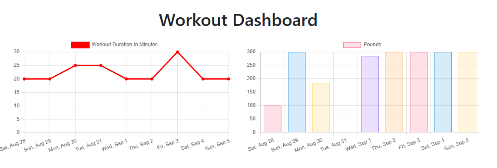

# Workout Tracker

### Description

Manage your workouts with this workout tracker.

### Table of Contents

- [Usage Guide](#Usage-Guide)
- [Install Instructions](#Installation)
- [Technologies Used](#Technologies-Used)
- [Contributions](#Contributions)
- [Tests](#Tests)
- [Questions](#Questions)

## Usage Guide

Deployed on [Heroku](https://intense-springs-06464.herokuapp.com/) This application allows you track your workouts, add to existing, create new ones and trend on the last 7 days of workouts.

Get started with the fitness tracker [here](https://intense-springs-06464.herokuapp.com/)

## Technologies Used

MongoDB, Node, mongoose, expresss

## Contributions

This is currently my own work. Please feel free to submit your contributions on GITHUB with credits given

## Tests

Future testing planned using Jest testing framework

## Questions

If you have any questions or want to keep up with my latest projects, please follow me on [Github](http://www.github.com/operationBrass) or contact me via [Email](mr.brn.lewis@outlook.com).
